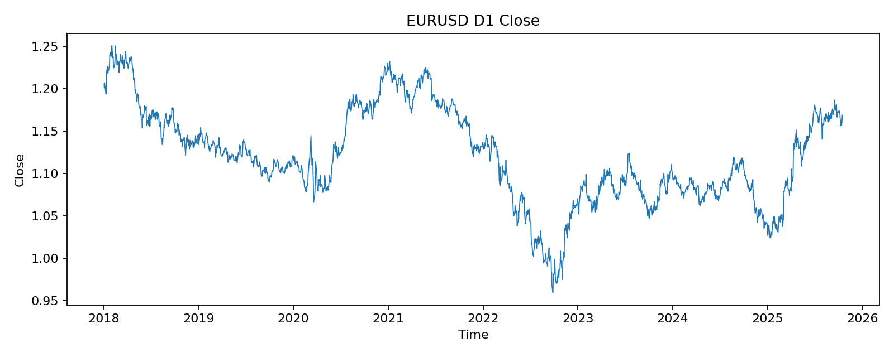
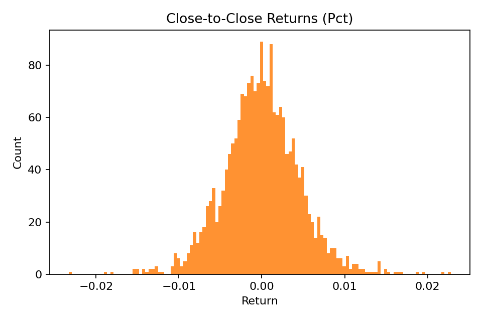
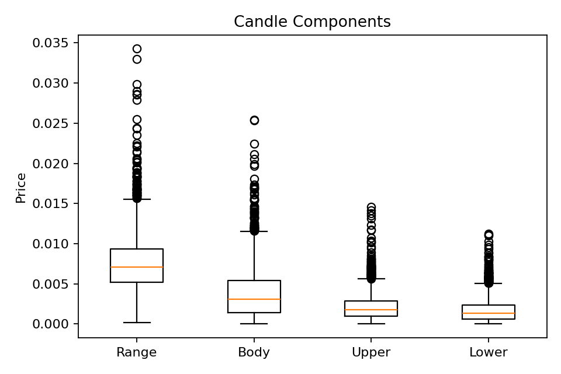
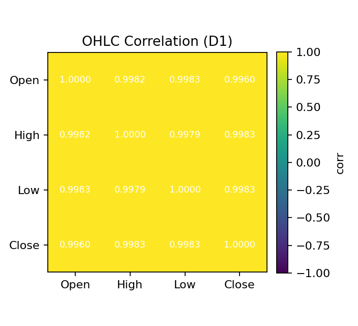
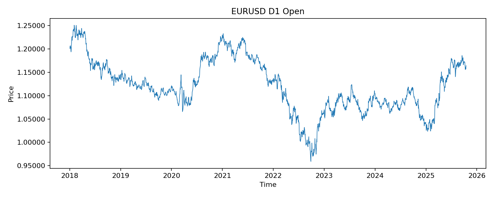
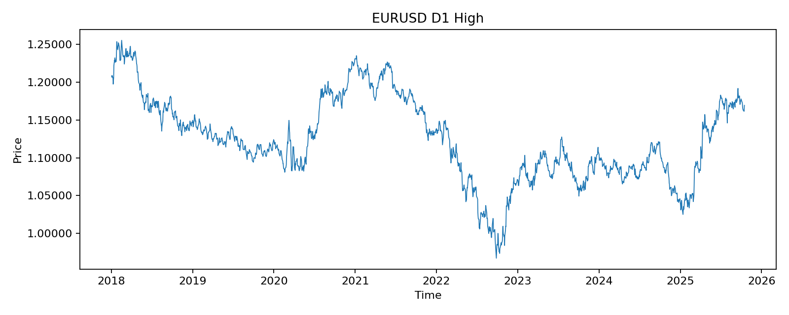
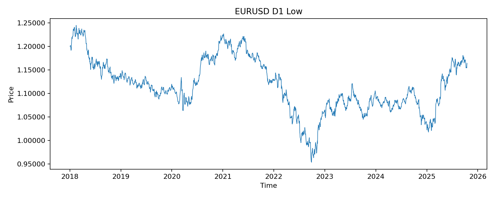
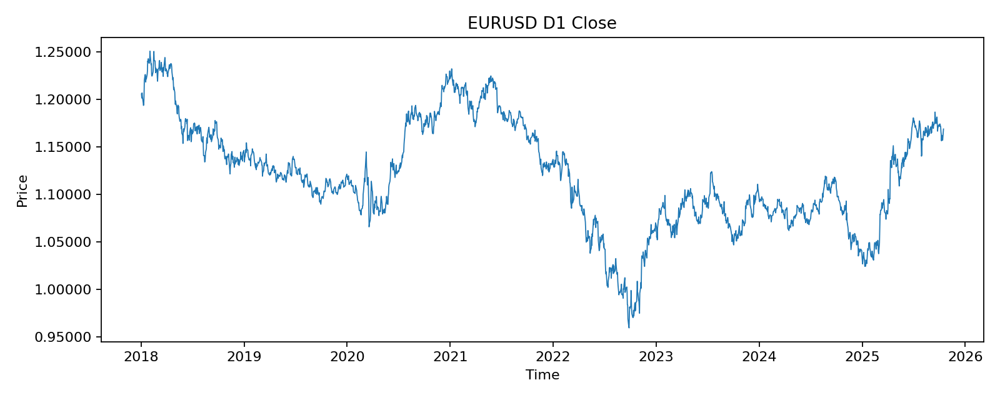
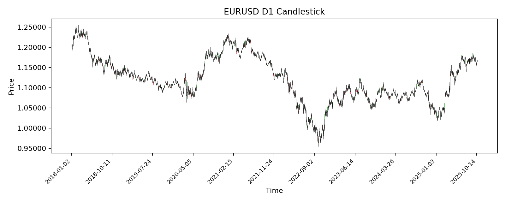

# EDA: EURUSD D1

Dataset: `EURUSD_D1_25Oct17.csv` (tab-delimited)

## Snapshot
- Rows: 2023
- Columns: ['datetime', 'Open', 'High', 'Low', 'Close']
- Datetime range: 2018-01-02 00:00:00 to 2025-10-16 00:00:00
- Frequency: 1D
- Duplicate timestamps: 0
- Irregular time gaps (expected 1D): 412

## Missing Values
- datetime: 0
- Open: 0
- High: 0
- Low: 0
- Close: 0

## Sanity Checks
- High < max(Open, Close, Low) violations: 0
- Low > min(Open, Close, High) violations: 0

## Summary Stats (selected percentiles)
                   count      mean      std       min        1%        5%       50%      95%      99%      max
Open         2023.000000  1.120211 0.056554  0.959070  0.984492  1.029877  1.116050 1.217727 1.236859 1.250750
High         2023.000000  1.124310 0.056310  0.967080  0.991160  1.035463  1.119890 1.221829 1.241296 1.255530
Low          2023.000000  1.116572 0.056761  0.953570  0.980623  1.025834  1.112570 1.215082 1.232245 1.244730
Close        2023.000000  1.120247 0.056493  0.959250  0.984635  1.030629  1.116140 1.217519 1.236736 1.250780
range        2023.000000  0.007737 0.003690  0.000210  0.002600  0.003372  0.007100 0.014547 0.019967 0.034280
body         2023.000000  0.003854 0.003283  0.000000  0.000060  0.000260  0.003060 0.010069 0.015196 0.025400
upper_shadow 2023.000000  0.002154 0.001721  0.000000  0.000082  0.000310  0.001750 0.005403 0.007890 0.014620
lower_shadow 2023.000000  0.001729 0.001580  0.000000  0.000000  0.000080  0.001320 0.004820 0.007196 0.011210
close_return 2022.000000 -0.000005 0.004599 -0.023288 -0.010707 -0.007269 -0.000051 0.007294 0.012010 0.022809

## OHLC Correlation
        Open   High    Low  Close
Open  1.0000 0.9982 0.9983 0.9960
High  0.9982 1.0000 0.9979 0.9983
Low   0.9983 0.9979 1.0000 0.9983
Close 0.9960 0.9983 0.9983 1.0000

## Stationarity Tests (ADF & KPSS)
| Variable | Test | Statistic | p-value | Lags | Conclusion |
|---|---|---:|---:|---:|---|
| Open | ADF | -2.1963 | 0.207581 | 0 | Non-stationary |
| Open | KPSS | 2.0755 | 0.010000 | 28 | Non-stationary |
| High | ADF | -2.1888 | 0.210327 | 2 | Non-stationary |
| High | KPSS | 2.0760 | 0.010000 | 28 | Non-stationary |
| Low | ADF | -2.2004 | 0.206110 | 1 | Non-stationary |
| Low | KPSS | 2.0641 | 0.010000 | 28 | Non-stationary |
| Close | ADF | -2.2176 | 0.199917 | 0 | Non-stationary |
| Close | KPSS | 2.0602 | 0.010000 | 28 | Non-stationary |
| Log Return | ADF | -44.4861 | 0.000000 | 0 | Stationary |
| Log Return | KPSS | 0.1462 | 0.100000 | 7 | Stationary |

Interpretation: ADF null is non-stationary; KPSS null is stationary.

## Plots

