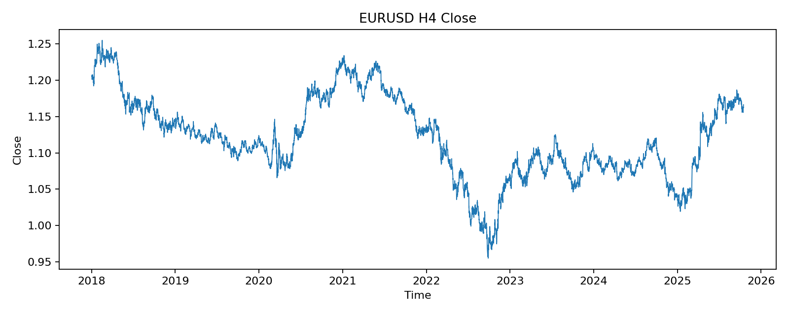
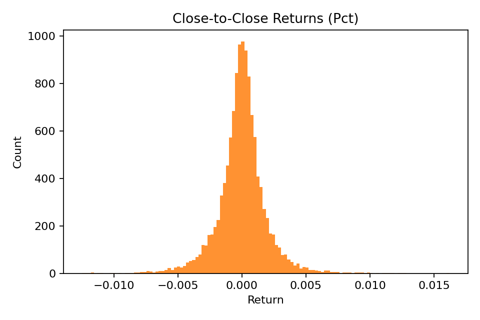
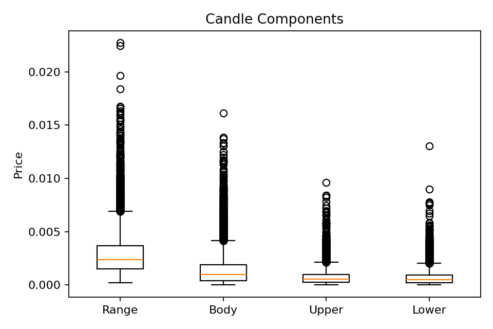
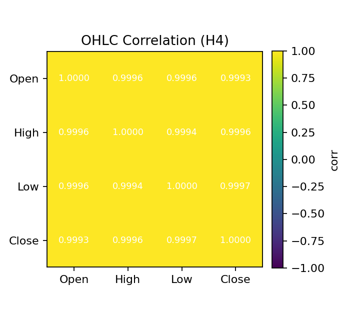
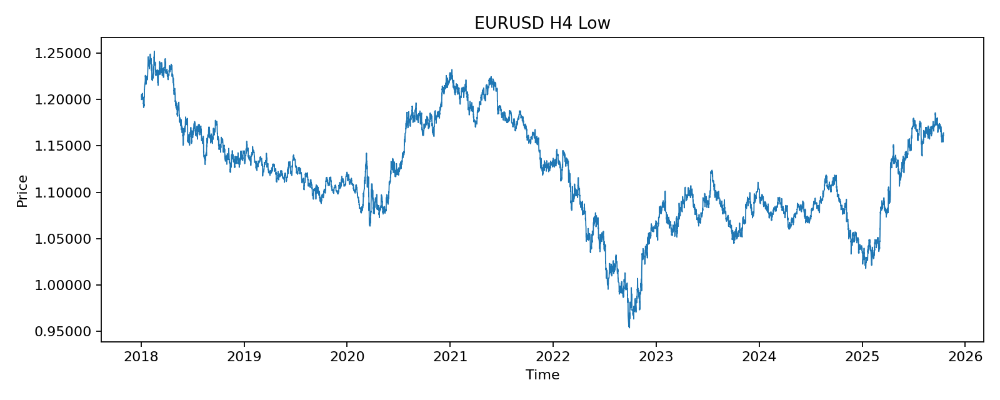
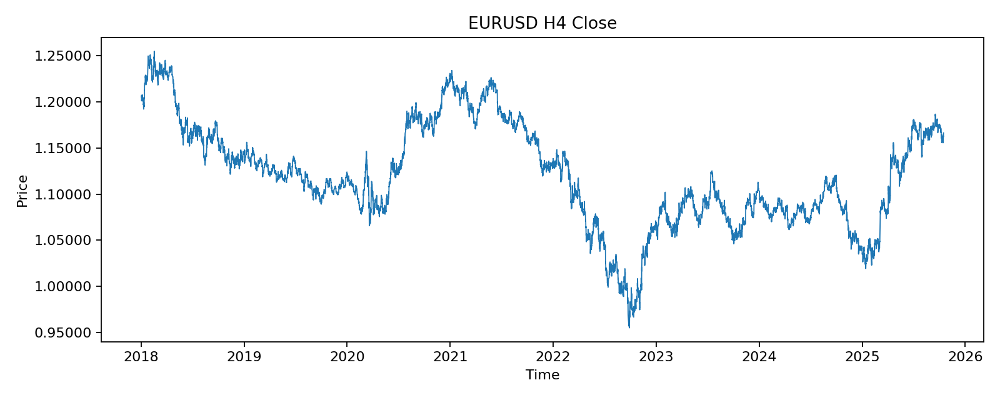
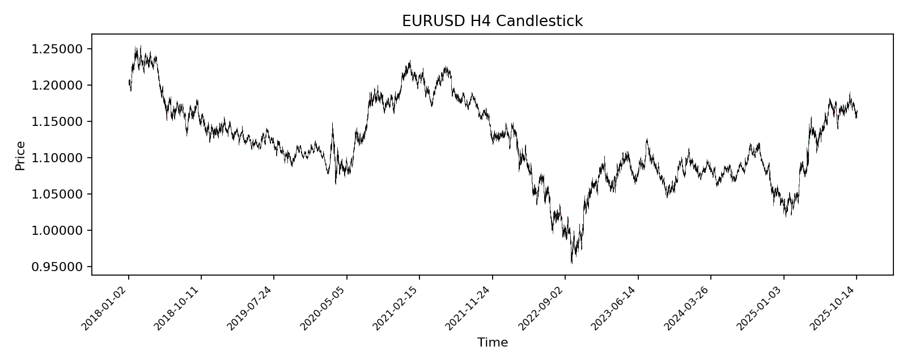

# EDA: EURUSD H4

Dataset: `EURUSD_H4_25Oct17.csv` (tab-delimited)

## Snapshot
- Rows: 12128
- Columns: ['datetime', 'Open', 'High', 'Low', 'Close']
- Datetime range: 2018-01-02 00:00:00 to 2025-10-16 00:00:00
- Monotonic increasing: True
- Duplicate timestamps: 0
- Irregular time gaps (expected 4H): 412

## Missing Values
- datetime: 0
- Open: 0
- High: 0
- Low: 0
- Close: 0

## Sanity Checks
- High < max(Open, Close, Low) violations: 0
- Low > min(Open, Close, High) violations: 0

## Summary Stats (selected percentiles)
                    count      mean      std       min        1%        5%      50%      95%      99%      max
Open         12128.000000  1.120422 0.056616  0.955070  0.984348  1.029990 1.116335 1.218096 1.237427 1.254830
High         12128.000000  1.121908 0.056519  0.957630  0.986818  1.031460 1.117620 1.219702 1.238777 1.255530
Low          12128.000000  1.118987 0.056685  0.953570  0.982423  1.028495 1.115225 1.216897 1.235928 1.252260
Close        12128.000000  1.120428 0.056606  0.955050  0.984348  1.030147 1.116325 1.218106 1.237429 1.254840
range        12128.000000  0.002921 0.001987  0.000210  0.000640  0.000890 0.002410 0.006690 0.010025 0.022720
body         12128.000000  0.001447 0.001525  0.000000  0.000010  0.000080 0.000970 0.004420 0.007360 0.016140
upper_shadow 12128.000000  0.000760 0.000765  0.000000  0.000000  0.000050 0.000550 0.002200 0.003595 0.009600
lower_shadow 12128.000000  0.000715 0.000750  0.000000  0.000000  0.000030 0.000490 0.002167 0.003495 0.013040
close_return 12127.000000 -0.000001 0.001912 -0.012493 -0.005483 -0.003039 0.000018 0.002914 0.005468 0.016213

## OHLC Correlation
        Open   High    Low  Close
Open  1.0000 0.9996 0.9996 0.9993
High  0.9996 1.0000 0.9994 0.9996
Low   0.9996 0.9994 1.0000 0.9997
Close 0.9993 0.9996 0.9997 1.0000

## Plots

